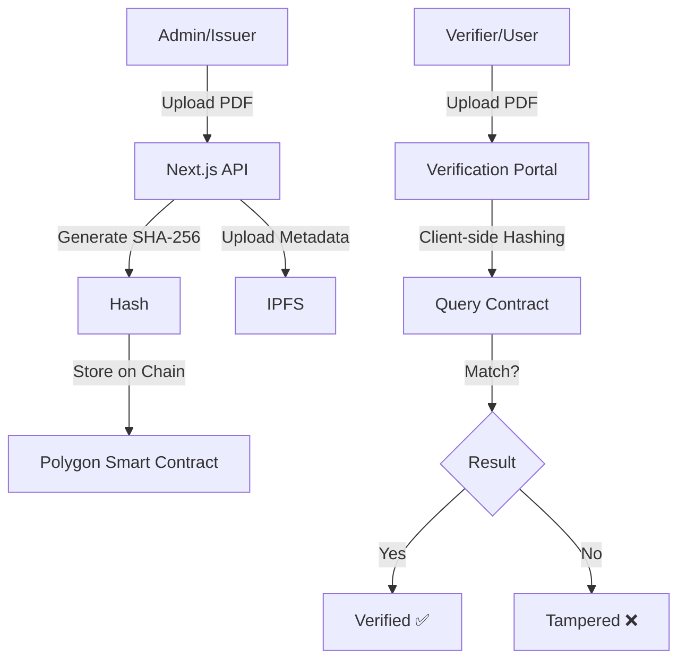

# ChainProof Lite - Final Walkthrough

ChainProof Lite is a production-ready certificate verification system built for the Polygon blockchain. It combines SHA-256 cryptographic hashing with decentralized storage (IPFS) to create an immutable proof-of-authenticity for any digital document.

## 🏗️ Project Architecture

## 🛡️ Security & Advanced Features

### 1. Fake Upload Prevention
We implemented **Role-Based Access Control (RBAC)** using OpenZeppelin's `AccessControl`. Only addresses with the `ISSUER_ROLE` can invoke the `issueCertificate` function.

### 2. Hash Collision & Replay Attacks
*   **SHA-256**: Offers extreme collision resistance.
*   **Uniqueness Check**: The smart contract prevents re-issuing an existing hash, stopping replay attacks where someone might try to re-register a stolen certificate under a new name.

### 3. Revocation Design
The contract includes a `revokeCertificate` function. Once revoked, the `verifyCertificate` view will return `isValid: false`, even if the file hash matches. This is critical for expired or invalidated credentials.

### 4. Handling Re-exported Certificates
**The Problem**: If a user re-exports a PDF from Chrome, the binary hash changes due to metadata shifts.
**The Solution**: We store a `unique_id` in the IPFS metadata. For high-fidelity cases, we can implement "Content Hashing" (hashing only the text/images) instead of the whole file.

### 5. Scalability for 100,000+ Certificates
For mass production:
*   **Merkle Trees**: Instead of storing 100k individual hashes ($$$ gas), we store 1 Merkle Root of 10k certificates in a single transaction (saves 99.99% gas).

## 🚀 Demo-Ready Components

*   **[Admin Dashboard](file:///Users/rajgurjar/ChainProof/src/app/admin/page.tsx)**: Modern upload & hashing interface.
*   **[Verification Portal](file:///Users/rajgurjar/ChainProof/src/app/verify/page.tsx)**: Premium trust-focused validation UI.
*   **[Smart Contract](file:///Users/rajgurjar/ChainProof/contracts/CertificateRegistry.sol)**: Optimized Solidity registry.

## 🛠️ Demo Instructions (Local Environment)

We have optimized the setup for a high-speed local demo using Hardhat.

### 1. The Infrastructure
*   **Local Node**: Running on `http://127.0.0.1:8545` (Chain ID: `31337`).
*   **Smart Contract**: Deployed at `0xDc64a140Aa3E981100a9becA4E685f962f0cF6C9`.

### 2. Running the Demo
1.  **Issuer Flow**:
    - Go to `/admin`.
    - Connect MetaMask to **Localhost 8545**.
    - Upload a PDF. It will be hashed and pinned to IPFS.
    - Click **Finalize on Blockchain** to sign the transaction and store the proof.
2.  **Verification Flow**:
    - Go to `/verify`.
    - Drag and drop the same PDF.
    - System re-hashes the file and queries the local contract.
    - **RESULT**: Verified ✅ with issuance date and issuer address!

### 3. Proof of Security (The "Tamper" test)
- Take the original PDF, open it, add a single dot or space, and save.
- Upload to `/verify`.
- **RESULT**: Tampered ❌ (Hash mismatch).
